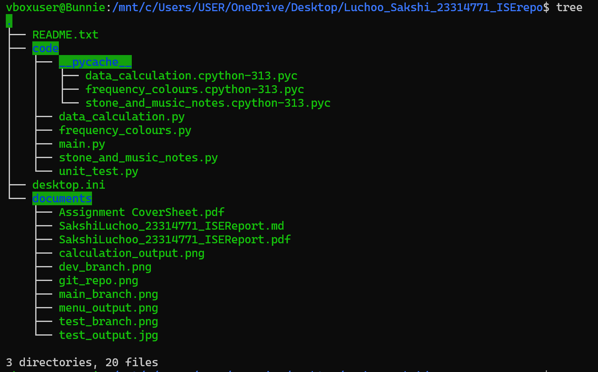

# Sakshi_Luchoo_23314771_ISEReport.md

## Cover Page
 
**Student Name:** Sakshi Luchoo  
**Student ID:** 23314771  
**Practical Class:** Cl 0.5, Tuesday group (12.30 - 14:30) 
  

---

## Introduction
This report documents the completed development of a 'Electromagnetic(EM) spectrum' system that identifies and verifies colour visibility of frequencies among other identification tools that performs various calculations related to the electromagnetic spectrum and color analysis. This documentation contains an in-depth description of the program modules implemented(`data_calculation.py`, `frequency_colours.py`, `stone_and_music_notes.py`, `main.py`). The software was developed following modularity principles. The system has undergone thorough testing using black-box and white-box approaches. Furthermore, Git version control was maintained throughout the development process.

---

## Module Descriptions

### 1. data_calculation.py
**Purpose:** Calculates given frequency's wavelength and given wavelength's frequency

**Methods:**
- `calculate_wavelength_of_freq(freq_in_THz)`
- `calculate_freq_of_wavelength(wavelength_in_nm)`

```python
# Function to find the wavelength of the frequency given
def calculate_wavelength_of_freq(freq_in_THz):
    conversion = 300000000   # c = 3 * 10^8 m/s (conversion forumla)
    wavelength = conversion / freq_in_THz   # Calculating wavelength 
    return wavelength

# Function to find the frequency of the wavelength given
def calculate_freq_of_wavelength(wavelength_in_nm):
    conversion = 300000000 
    freq_in_Hz = conversion / wavelength_in_nm    # Calculating frequency
    return freq_in_Hz
```

**Inputs/Outputs:** 

- calculate_wavelength_of_freq(freq_in_THz)
Input: `calculate_wavelength_of_freq(39,999)`
Output: `7500.187504687618nm` (float)

- calculate_freq_of_wavelength(wavelength_in_nm)
Input: `calculate_freq_of_wavelength(2000)`
Output: `150000.0THz` (float)
 
### 2. frequency_colours.py
**Purpose:** Details about colour names and their frequencies ranges used for comparisons

**Methods:**
- `get_colour_freq(colour)`
- `freq_colours(freq_value)`
- `get_visible_colours(freq_value)`
- `compare_two_freq(freq_val1, freq_val2)`

```python
# Dictionary containing colour options and their upper and lower bound frequency values
colour_freq_bounds = {'violet': (670, 790),       
                          'blue': (620, 669),
                          'cyan': (600, 619),
                          'green': (530, 599),
                          'yellow': (510, 529),
                          'orange': (480, 509),
                          'red': (400, 479)}
min_visible_light = 400
max_visible_light = 790

# Function to return colour from colours available 
def get_colour_freq(colour):
    colour = colour.lower()
    if colour not in colour_freq_bounds:
        raise ValueError(f'Unavailable colour: {colour}')     # Raises an error if the user has input an invalid colour choice
    return colour_freq_bounds[colour]

# Function to find and return colour produced by frequency given by user
def freq_colours(freq_value):
    if freq_value < min_visible_light:
        return 'Frequency value is below the Visible Light range (lower than frequency of Red)'
    elif freq_value > max_visible_light:
         return 'Frequency value is above the Visible Light range (higher than frequency of Violet)'
    
    # For loop created to access color name, min and max boundary values for frequency(in the dictionary)     
    for colour, (min, max) in colour_freq_bounds.items():  
        if min <= freq_value <= max:         # Freq value is user input value for frequency
           return f'Corresponding colour is: {colour}'
    

# Function to return visible colour names
def get_visible_colours(freq_value):
    for colour, (min, max) in colour_freq_bounds.items():  
        if min <= freq_value <= max:  
            return colour     # Colour is visible so colour name is returned
    return None       # Colour is not in the Visible Light range

# Function to compare the two frequency values to find if both represent a single colour or two different colours
def compare_two_freq(freq_val1, freq_val2):
    val1_visible = get_visible_colours(freq_val1)     # Get colour frequencies(min and max) for comparison process
    val2_visible = get_visible_colours(freq_val2)

    if not val1_visible and not val2_visible:
        return (f'Neither frequency is visible: {freq_val1}THz, {freq_val2}THz')
    if not val1_visible:
        return (f'Frequency {freq_val1}THz is not within the Visible Light range')
    if not val2_visible:
        return (f'Frequency {freq_val2}THz is not within the Visible Light range')
    
    colour1 = get_visible_colours(freq_val1)
    colour2 = get_visible_colours(freq_val2)

    # Find if both represent the same colour or not
    if colour1 == colour2:
        return 'Both frequencies represent the same colour'
    else:
        return 'Both frequencies represent different colours'

```

**Inputs/Outputs:** 
- get_colour_freq(colour)
 Input: `get_colour_freq("violet")` (string)
 Output: `(670, 790)`

- freq_colours(freq_value)
*For colour name*
 Input: `freq_colours(400)`
 Output: `"Corresponding colour is: red"`
 *For out-of-range message*
 Input: `freq_colours(300)`
 Output: `"Frequency value is below the Visible Light range (lower than frequency of Red)"`

- get_visible_colours(freq_value)
 Input: `get_visible_colours(610)`
 Output: `"cyan"`
 
- compare_two_freq(freq_val1, freq_val2)
*In range example*
 Input: `compare_two_freq(500, 500)`
 Output: `"Comparison results are:
 Both frequencies represent the same colour"`
*Out-of-range example*
 Input: `compare_two_freq(300, 600)`
 Output: `"Comparison results are:
 Frequency 300THz is not within the Visible Light range"`

### 3. stone_and_music_notes.py
**Purpose:** Provides color associations with stones, music notes, and emotions

**Methods:**
- `get_colour_facts(colour)`

```python
# Outer dictionary(colour names) containing inner dictionaries(colour facts)
colour_notes = {'violet':{'Matching Stone':'Amethyst',
                          'Matching Music note':'B',
                          'Matching Emotion':'Bravery'},

                'blue':{'Matching Stone':'Opal',
                        'Matching Music note':'A',
                        'Matching Emotion':'Calm'}, 

                'cyan':{'Matching Stone':'Turquoise',
                        'Matching Music note':'G',
                        'Matching Emotion':'Calm'},

                'green':{'Matching Stone':'Emerald',
                        'Matching Music note':'F',
                        'Matching Emotion':'Peaceful'},  

                'yellow':{'Matching Stone':'Topaz',
                        'Matching Music note':'E',
                        'Matching Emotion':'Happy'}, 

                'orange':{'Matching Stone':'Moonstone',
                        'Matching Music note':'D',
                        'Matching Emotion':'Happy'}, 

                'red':{'Matching Stone':'Garnet',
                        'Matching Music note':'C',
                        'Matching Emotion':'Confidence'}}

# Function to check whether user has entered a colour that is available in the dictionary
def get_colour_facts(colour):
    colour = colour.lower()
    if colour not in colour_notes:
        raise ValueError(f'Colour {colour} is not available to obtain facts')
    return colour_notes[colour]
``` 

**Inputs/Outputs:**
- get_colour_facts(colour)
 Input: `get_colour_facts("orange")`
 Output: `"Stone association": "Moonstone",
"Musical note association": "D",
"Emotion association": "Happy"`

### 4. main.py
**Purpose:** User interface and main program execution 

**Methods:**
- `start_up_menu()`
- `main()`

**Control Flow:**
1. Menu display
2. Prompt user input (1-8)
3. Call module functions needed
4. Output appropriate results

**Inputs:** 
- User selections (1-8)
- Corresponding data inputs  

**Outputs:** 
- Menu display
- Calculation results  


**Design Explanation:**
- Separated concerns into logical and flexible modules
- Used dictionaries to keep record of color data for easy lookups
- Implemented input validation and error handling(try..except, raise)
- Followed single responsibility principle for functions
- Used clear and meaningful names for variables and functions 

---

## Modularity Implementation

#### Running and Testing the Production Code
Execute the program by running the following in your command prompt terminal:
```bash
 cd code    # To enter code file folder
 python3 main.py  # Run the main program  
```

**Sample Output:**

*Sample output screenshot showing menu display*


*Sample output screenshot showing frequency color calculation result*


#### Checklist Review

| Criteria                  | Yes/No | Comments                                                                 | Action Needed/Notes                          |
|-------------------------------|--------|--------------------------------------------------------------------------|----------------------------------------------|
| **Single responsibility**     | Yes    | Does each module have a single responsibility? ✔                         | Each module handles a specific functionality/task |
| **Input/Output clarity**      | Yes    | Are inputs and outputs clearly defined? ✔                                | Clear parameter passing and return values used |
| **Reusability**               | Yes    | Is there minimal dependence across modules? ✔                               | Functions used for calculations and to store and search data are independent           |
| **Separation of concerns**    | Yes    | Are functions small and focused? ✔                                       | Each function handles one specific task      |
| **Meaningful names**        | Yes    | Are meaningful names used throughout? ✔                                  | Consistent, meaningful, clear and descriptive naming followed      |
| **Error handling**            | Yes    | Is error handling implemented? ✔                                         | Thorough input validation and exception handling included |
|    **Encapsulation**         | Yes    | Are there no code duplications? ✔                                        | No duplication of code. Implementation details are well encapsulated as all data needed are accessed through functions                   |
| **Testing ready**             | Yes    | All criteria met for testability                                         | Modules can be tested independently          |


**Changes made:** Code tweaks and small changes in variable names in modules, `main.py`, `frequency_colours.py`, `data_calculation.py` and `stone_and_music_notes.py`

#### Refactoring Decisions
No major refactoring was needed, only minor improvements:
- Added more specific error messages
- Consistent function and variable names
- Ensured standardized return types

---
## Test Design
### A) Black-Box Test Case Design

#### 1. *Equivalence Partitioning:*

| Module being tested  | Function | Test Case | Input | Expected Output | Actual Output | Pass/Fail  |
|-------------|----------|-----------|----------|-----------------|---------------|-----------|
| data_calculation.py | calculate_wavelength_of_freq | Valid frequency | 5000 | 60000.0nm | 60000.0nm | ✔ |
|  | calculate_freq_of_wavelength | Valid frequency | 7000 | 42857.142857142855THz | 42857.142857142855THz | ✔ |
|stone_and_music_notes.py  | get_colour_facts | Invalid colour choice input | "pink" | "Unavailable colour option! Please try again" | As expected | ✔ |
| frequency_colours.py | compare_two_freq | Neither frequencies are visible | 900, 900  | "Comparison results are: Neither frequencies are visible: 900THz, 900THz" | As expected | ✔ |
| | | Valid frequencies | 400, 700 | "Comparison results are: Both frequencies represent different colours" | As expected | ✔ |
| frequency_colours.py | freq_colours | Within Visible Light range | 771 (Last 3 digits of student ID) | "Corresponding colour is: violet" | "Corresponding colour is: violet" | ✔ |
| main.py | main | Invalid choice input | "Luchoo" | "Invalid choice Luchoo. Please choose from the options available (1-8)" | As expected | ✔ |

#### 2. *Boundary Value Analysis:*

| Module | Function | Test Case | Input | Expected Output | Actual Output | Pass/Fail |
|--------|----------|-----------|-------|-----------------|---------------|-----------|
| frequency_colours.py | freq_colours | Lower boundary | 400  | "red" | "red" | ✔ |
| | | Upper boundary | 790 | "violet" | "violet" | ✔ |
| | | Just below | 791 | "Frequency value is above the Visible Light range (higher than frequency of Violet)" | As expected | ✔ |
| data_calculation.py| calculate_wavelength_of_freq | Lower boundary | 1 | "Wavelength is: 300000000.0nm" | As expected | ✔ |
| | calculate_wavelength_of_freq | Upper boundary | 40000 | "Wavelength is: 7500.0nm" | As expected | ✔ |

---

### B) White-Box Test Cases

#### Tested Modules
1. ***frequency_colours.py***
 - `get_visible_colours()` 
2. ***data_calculation.py***
 - `calculate_freq_of_wavelength()`  

| Module | Function | Path Test Case (Input values) | Path Covered | Expected Result | Actual Result | Pass/Fail |
|--------|----------|-----------|--------------|----------|--------|-----------|
| frequency_colours.py | get_visible_colours | Freq 450 | 'If' selection statement path for red | "red" | "red" | ✔ |
| data_calculation.py | calculate_freq_of_wavelength| Wavelength 600 | Calculation path | 500000.0THz | 500000.0THz | ✔ |

---

## Test Implementation
To run the test module, write the following in your terminal:
```bash
python3 unit_test.py
```
#### *Test code*
```python
import unittest
from frequency_colours import *

class MyTestCase(unittest.TestCase):
    # Function to test in the two colours are visible
    def test_visible_range(self):
        # Testing red edge in visible light range
        assert freq_colours(400) == "Corresponding colour is: red"  # Min red freq
        assert freq_colours(479) == "Corresponding colour is: red"  # Max red freq
        # Testing violet edge in visible light range
        assert freq_colours(670) == "Corresponding colour is: violet"  # Min violet freq
        assert freq_colours(790) == "Corresponding colour is: violet"  # Max violet freq

    # Function to test the two colours going out of range
    def  test_visible_outrange(self):
        # Above visibility range
        assert freq_colours(791) == "Frequency value is above the Visible Light range (higher than frequency of Violet)"  # Upper boundary is 790
        # Below visibility range
        assert  freq_colours(399) == "Frequency value is below the Visible Light range (lower than frequency of Red)"  # Lower boundary is 400

if __name__ == '__main__':
    unittest.main()
```

**Results:**
- Black-box test cases passed
- White-box test cases passed

***1 test failure encountered: Assertion error***
It was fixed by changing the code structure (use of a class to create methods instead of independent functions)

#### **Test results after correcting test error:**


---

## Traceability Matrix

| Module name    | Black-Box (EP) | Black-Box (BVA)| White-Box | Data Types | Input/Output method        |
|--------------|-------|--------|----------|------------|-------------------|
| data_calculation.py | done | done | done | integer, float | parameter/return | 
| frequency_colours.py | done | done | done | integer, str | parameter/return | 
| stone_and_music_notes.py | done | not done | not done | string | parameter/return |
| main.py | done | not done | not done | integer, string | console I/O |

---

## Version Control System

**Git log commit history:-**


**Repository Structure:**  


**Branch Strategy:**
- `main`: Stable production code
- `dev`: Development branch
- `test`: Test code branch

---

## Discussion

#### Achievements
- Fully functional color analysis tool
- Clear interface documentation 
- Efficient modular design 

#### Challenges faced
- Handling in frequency/wavelength calculations with rounding off values
- Ensuring consistent user experience across menu options
- Correct error handling 
- Maintaining correct match-case structure

#### Limitations
- Limited predefined color set
- Simple integer and string inputs 

#### Future Improvements
 The requirements of this project were met while successfully implementing professional software engineering practices and ethics. This modular design proved to be efficient by running multiple test cases/test implementations. Furthermore, the program has a good version control system as there is easy tracking of changes made to files through the history of modifications and there is a clear progression of code across the software development lifecycle. Although good programming and software engineering practices ere used, the structure of the porgram modules could be improved by expanding the color database and supporting decimal inputs as well.

